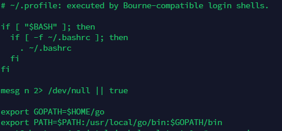

# Prep Node Install

**Complete Update and Upgrade**

```
sudo apt update
```

```
sudo apt upgrade
```

**Install Ignite**

```
curl https://get.ignite.com/cli! | sudo bash
```

**Install GCC**

```
sudo apt install gcc
```

**Install Go**

```
curl --output go1.18.4.linux-amd64.tar.gz https://dl.google.com/go/go1.18.4.linux-amd64.tar.gz
```

```
sudo tar -C /usr/local/ -xzf go1.18.4.linux-amd64.tar.gz
```

**Specify Go path in nano \~/.profile:**

```
sudo nano $HOME/.profile
```

* Paste the following below existing text


```
export GOPATH=$HOME/go
export PATH=$PATH:/usr/local/go/bin:$GOPATH/bin
```


* Save and Exit. \[Ctrl-X, then Ctrl-Y, then Enter]

Execute the following to apply the changes:

```
source ~/.profile
```

Now, we can run go commands from the terminal.

But before that let’s see if we have saved the file correctly.

We simply **cat** the file content.

```
cat $HOME/.profile
```

<figure><figcaption><p>Expected Output</p></figcaption></figure>

Now, we can test if we can run Go commands from the terminal.

Check installed Go version

Run the command **`go version`** to check the version installed

```
go version
```

**Install Chain**

```
git clone https://karnthis@github.com/JackalLabs/canine-chain
```

**Switch to Canine Chain directory**

```
cd canine-chain
```

**Switch to current chain**

```
git switch woof-2
```

**Initiate chain build**

```
ignite chain build
```
